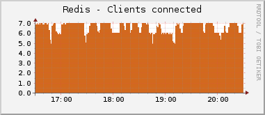
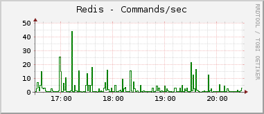
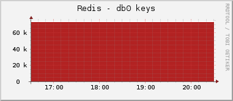
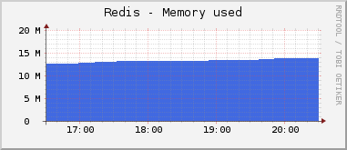
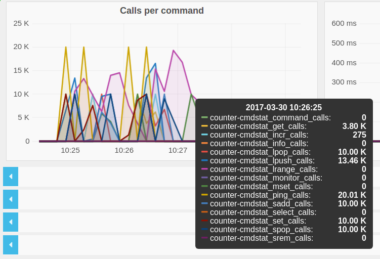
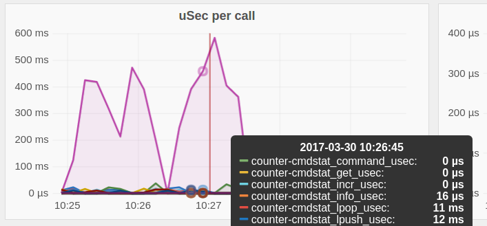

redis-collectd-plugin
=====================

A [Redis](http://redis.io) plugin for [collectd](http://collectd.org) using collectd's [Python plugin](http://collectd.org/documentation/manpages/collectd-python.5.shtml).

You can capture any kind of Redis metrics like:

 * Memory used
 * Commands processed per second
 * Number of connected clients and slaves
 * Number of blocked clients
 * Number of keys stored (per database)
 * Uptime
 * Changes since last save
 * Replication delay (per slave)

Install
-------

 1. Place `redis_info.py` in `/opt/collectd/lib/collectd/plugins/python` (assuming you have collectd installed to /opt/collectd).
 2. Configure the plugin (see below).
 3. Restart collectd.

Configuration
-------------

Add the following to your collectd config **or** use the included redis.conf for full example.
Notice, you will have to adjust *cmdset* section depending on the Redis version, see below.


```text
    # Configure the redis_info-collectd-plugin

    <LoadPlugin python>
      Globals true
    </LoadPlugin>

    <Plugin python>
      ModulePath "/opt/collectd/lib/collectd/plugins/python"
      Import "redis_info"

      <Module redis_info>
        Host "localhost"
        Port 6379
        # Un-comment to use AUTH
        #Auth "1234"
        Verbose false
        #Instance "instance_1"
        # Redis metrics to collect (prefix with Redis_)
        Redis_db0_keys "gauge"
        Redis_uptime_in_seconds "gauge"
        Redis_uptime_in_days "gauge"
        Redis_lru_clock "counter"
        Redis_connected_clients "gauge"
        Redis_connected_slaves "gauge"
        Redis_blocked_clients "gauge"
        Redis_evicted_keys "gauge"
        Redis_used_memory "bytes"
        Redis_used_memory_peak "bytes"
        Redis_changes_since_last_save "gauge"
        Redis_instantaneous_ops_per_sec "gauge"
        Redis_rdb_bgsave_in_progress "gauge"
        Redis_total_connections_received "counter"
        Redis_total_commands_processed "counter"
        Redis_keyspace_hits "derive"
        Redis_keyspace_misses "derive"
        #Redis_master_repl_offset "gauge"
        #Redis_master_last_io_seconds_ago "gauge"
        #Redis_slave_repl_offset "gauge"
        Redis_cmdstat_info_calls "counter"
        Redis_cmdstat_info_usec "counter"
        Redis_cmdstat_info_usec_per_call "gauge"
        </Module>
    </Plugin>
```

Use below command and see which keys are present/missing:

```bash
redis-cli -h redis-host info commandset
```

For example certain entries will not show up, because they were never used.
Also if you enable verbose logging and see:

```text
... collectd[6139]: redis_info plugin: Info key not found: cmdstat_del_calls, Instance: redis-server.tld.example.org:6379

```

It means given redis server does not return such value, and you should comment out that from config, to avoid filling logs with not so useful data, not to mention that you may trigger dropping log lines.

### Multiple Redis instances

You can configure to monitor multiple redis instanceswith different config setups by the same machine by repeating the `<Module>` section, such as:

```text
<Plugin python>
  ModulePath "/opt/collectd_plugins"
  Import "redis_info"

  <Module redis_info>
    Host "127.0.0.1"
    Port 9100
    Verbose true
    Instance "instance_9100"
    Redis_uptime_in_seconds "gauge"
    Redis_used_memory "bytes"
    Redis_used_memory_peak "bytes"
  </Module>

  <Module redis_info>
    Host "127.0.0.1"
    Port 9101
    Verbose true
    Instance "instance_9101"
    Redis_uptime_in_seconds "gauge"
    Redis_used_memory "bytes"
    Redis_used_memory_peak "bytes"
    Redis_master_repl_offset "gauge"
  </Module>

  <Module redis_info>
    Host "127.0.0.1"
    Port 9102
    Verbose true
    Instance "instance_9102"
    Redis_uptime_in_seconds "gauge"
    Redis_used_memory "bytes"
    Redis_used_memory_peak "bytes"
    Redis_slave_repl_offset "gauge"

    # notice, this is not added in above sections
    Redis_cmdstat_info_calls "counter"
    Redis_cmdstat_info_usec "counter"
    Redis_cmdstat_info_usec_per_call "gauge"
  </Module>
</Plugin>
```

These 3 redis instances listen on different ports, they have different plugin_instance combined by Host and Port:

```text
"plugin_instance" => "127.0.0.1:9100",
"plugin_instance" => "127.0.0.1:9101",
"plugin_instance" => "127.0.0.1:9102",
```

These values will be part of the metric name emitted by collectd, e.g. ```collectd.redis_info.127.0.0.1:9100.bytes.used_memory```

If you want to set a static value for the plugin instance, use the ```Instance``` configuration option:

```text
...
  <Module redis_info>
    Host "127.0.0.1"
    Port 9102
    Instance "redis-prod"
  </Module>
...
```

This will result in metric names like: ```collectd.redis_info.redis-prod.bytes.used_memory```

```Instance``` can be empty, in this case the name of the metric will not contain any reference to the host/port. If it is omitted, the host:port value is added to the metric name.

### Multiple Data source types

You can send multiple data source types from same key by specifying it in the Module:

```
...
  <Module redis_info>
    Host "localhost"
    Port 6379

    Redis_total_net_input_bytes "bytes"
    Redis_total_net_output_bytes "bytes"
    Redis_total_net_input_bytes "derive"
    Redis_total_net_output_bytes "derive"
  </Module>
...
```

Graph examples
--------------

These graphs were created using collectd's [rrdtool plugin](http://collectd.org/wiki/index.php/Plugin:RRDtool), [drraw](http://web.taranis.org/drraw/) and [graphite](http://graphiteapp.org) with [grafana](https://grafana.com/).








Requirements
------------

 * collectd 4.9+
